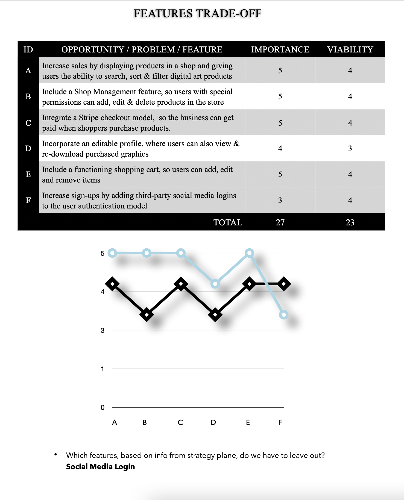

# Hue

This full-stack application was developed for Hue, an online art shop where users can view and purchase graphic designs & digital assets. The main goal of this web application is to provide a digital space where Hue can display & sell products to customers. ***Please note: Hue is a fictional company that was created for the purpose of this project.***

As the Milestone 4 Project for [Code Institute's](https://codeinstitute.net) [Full Stack Software Development Diploma Program](https://codeinstitute.net/full-stack-software-development-diploma/), Hue was built with HTML5, CSS, Bootstrap 5, JavaScript, jQuery, Python 3 and Django, a popular high-level Python web framework.

## UX

### Summary

#### Background

Hue, a fictional team of graphic designers, needs one central application that they can use to manage, display & sell their products to customers. The team at Hue is in need of software that will give them the ability to:

- Add, edit and remove products from the shop

- Display products with details to customers

- Receive payments when products are purchased

Because they have been working freelance for a few years now, Hue's target market of loyal buyers already exists and is comprised of:

- Independent clients (male and female, ages 24 - 39) that want to preview and purchase graphic art & digital assets online. 

- Small businesses that want to preview, purchase and license graphic designs for branding needs.

- Digital art consumers, that wish to purchase & print digital art products.

To meet the needs of the target market(s), Hue's website should:

- Provide a list of products for users to view

- Include a functioning shopping cart that users can add, edit & remove items to & from.

- Allow users to fill out a form with credit card details and checkout successfully (via online Stripe payment)

- Automatically send ordered products to buyers after they are purchased (confirmation email & confirmation success page)

- Include a **Sign Up** page, where users can register and become members ***optional***

- Include a **Login** portal, so users may visit their profile, access order items & persist shopping carts between visits

- Include functionality that allows users to check out as guest, if desired

### Research & Planning

#### Strategy Plane Trade Off Activity

During the research & planning phase of this milestone project, the developer completed the following exercise to decide which features would be most viable & important.

After completing this exercise, it was determined by the developer that certain more, 'advanced' features (like third-party logins) are not essential or crucial to the core functionality or main shop manager goals of this application, and would not be included in this build.

#### Users

Once the trade off exercise was completed, the developer considered customizing the user model in Django and completed the below flowchart activity, titled "Django Multiple User Types". This activity was conducted to help the developer determine how to properly build and implement the Django user model.

[djangomultipleusertypes](wireframes/djangomultipleusertypes.pdf)

As can be seen in the image above, the activity led the developer to make the following conclusions:

- Hue's user authentication model should define a one-to-one relationship, using the [``OneToOneField``](https://docs.djangoproject.com/en/3.1/topics/db/examples/one_to_one/).

- Hue should be built for **two** different types of users:

  1) Shop Manager
    - Hue, the company, that wants to:
        - Sell digital artwork.

    1) Customer/Shopper
    - Digital art buyers (individuals & companies) that want to:
        - Find & purchase digital artwork from Hue online.

#### User Stories

User stories were created by the [developer](https://www.github.com/alissatroiano) during the planning phase of this project. As practiced in agile development, each user story coincides with a feature of the Hue application that was programmed by the developer during a sprint.

#### The following user stories were created for the **shopper**:

## Features

To meet all of Hue's goals and needs, this application will be built with the following features:

### Existing Features
[**Home:**](https://hue-alissa.herokuapp.com/)

  *Shopper*

  - Lets the user read the, 'About' section and choose from popular shop categories,  by including the 'about' section in the homepage and linking to it in the main navigation menu.

 *Shop Manager*
  - Provides a place to link back to, by including links in the navbar.
 
[**Shop:**](https://hue-alissa.herokuapp.com/shop/)

  *Shopper*

  - Allows *shoppers* to view, search, sort, and filter products, by having them visit the shop and utilized the built-in tools.

  *Shop Manager*
  - Gives the *shop manager* the opportunity to view the shop page as a regular shopper/user would.

[**Sign Up**](https://hue-alissa.herokuapp.com/accounts/signup/)

  - Provides a place for users to create an account, by having them fill out a form that uses HTTP `POST` requests to send data.

[**Login:**](https://hue-alissa.herokuapp.com/accounts/login/)

  *Shoppers*

  - Provides an opportunity for **shoppers** to persist their cart between visits, by logging in.
  
  *Shop Manager*

  - Allows *shop managers* to access shop management tools, by filling out a secure form and accessing a user profile with special site permissions.

[**Profile:**](https://hue-alissa.herokuapp.com/accounts/login/)

  - Lets users edit their profile, by filling out a form with profile details and submitting it.

  - Allows users to review order details & re-download order items, by listing orders that are linked to confirmation success pages and including digital downloads.

[**Shop Management**](https://hue-alissa.herokuapp.com/shop/add/)

- Allows the *shop manager* to access special product management tools hidden from other users, by logging in and clicking the, 'Shop Management' link in the, 'Profile' dropdown.

[**About**](https://hue-alissa.herokuapp.com/#about)
- Gives users information & details so they can learn about the business, by reading the 'about' section on the homepage.
  
## Technologies Used

- [Django](https://www.djangoproject.com/)
  - The project uses **Django** to simplify development and scalability.

- [django-allauth](https://django-allauth.readthedocs.io/en/latest/installation.html)
  - This project will uses **Allauth** to simplify user authentication, registration, account management and 3rd party (social media) login.

- [SQLite3](https://docs.python.org/3/library/sqlite3.html)
  - This application is using ***SQLite3*** for internal data storage during local development.

- [PostgreSQL](https://www.postgresql.org/)
  - This application is using ***PostgreSQL*** for internal data storage while deployed on Heroku's live development server.

- [Heroku](https://www.heroku.com/)
  - This application uses ***Heroku*** for domain hosting & deployment.

- [Pillow](https://pypi.org/project/Pillow/) 
  - This project will use **the Python Imaging Library, Pillow** to add image processing capabilities to the Python interpreter.

- [Virtual Environment Wrapper](https://virtualenvwrapper.readthedocs.io/en/latest/index.html)
  - This project makes use of virtualenvwrapper extensions for creating and deleting virtual environments and managing local development.

- [Homebrew](https://brew.sh/)
  - The developer used Homebrew to simplify software and package installations on MacOS and in local development.

- [Amazon S3](https://aws.amazon.com/s3/?nc=sn&loc=0)
  - This project uses the Amazon AWS S3 service to store media and static files.

- [Boto3](https://boto3.amazonaws.com/v1/documentation/api/latest/index.html)
  - This project relies on boto3 to create, configure, and manage AWS services, specifically S3. 

- [Botocore](https://pypi.org/project/botocore/)
    - This project uses the botocore package to connect to Amazon AWS services, as well as boto3.

- [Bootstrap 5](https://getbootstrap.com)
    - This project uses Bootstrap 5 to improve navigation, layout and responsiveness.

- [Crispy Forms](https://django-crispy-forms.readthedocs.io/en/latest/)
  - This project uses crispy filters & tags to control the rendering behavior of Django forms in a consistent, visually appealing and *DRY* manner.

- [Crispy-Bootstrap5](https://pypi.org/project/crispy-bootstrap5/) 
  - This project uses **Crispy-Bootstrap-5** to make the rendering of crispy Django forms compatible with Bootstrap 5.

- [Django-Countries](https://pypi.org/project/django-countries/)
  - This project uses the django-countries package for country model fields and to give users country choices in forms..

- [psycopg2-binary](https://pypi.org/project/psycopg2-binary/)
  - This project uses Psycopg for secure, effective PostgreSQL database adaption.

- [Gunicorn](https://gunicorn.org/)
  - This project uses Gunicorn to implement the PEP3333 WSGI server standard specification for running Python web applications that implement the application interface.

- [Stripe](https://stripe.com/docs)
  - This project uses Stripe test development tools to handle credit card transactions, accept payments and simulate a real E-commerce store. 

## Testing

Manual & automated testing was conducted by the developer to ensure the functionality of this full-stack application. To learn more about these tests, please review the contents of [TESTING.md](TESTING.md)

## Deployment

This project uses ***Heroku*** for live deployment. In order to ensure the application was successfully deployed, the developer followed these steps:

1) Load the data from 

## Credits

### Content

- The artwork categories in the database and application were copied from [Architecure Lab article "15 Types of Digital Art to Consider"](https://www.architecturelab.net/types-of-digital-art/)

- I copied Font Awesome's CDN from [cdnjs.com](https://cdnjs.com/libraries/font-awesome).

- The grayscale hover effect on the homepage was copied from this [Codepen](https://codepen.io/mhhasan320/pen/BwqvLL).

- I used this [Stack Overflow](https://stackoverflow.com/questions/31456576/django-footer-and-header-on-each-page-with-extends) thread for header, footer and body content templating with Django.

### Media

- The images used for the products in this project are all licensed under The Creative Commons license and were copied from:

#### Home page

- Hue's images (`/home/index.html`) were copied from the following sources:

- **Hero** background image: Pexels](https://www.pexels.com/photo/abstract-painting-2156881/)

- The favicon image was downloaded from [The Noun Project](https://thenounproject.com/term/tint/120414/) and is licensed by [Creative Commons](https://creativecommons.org)

- The background image for the **Surrealism** category card was copied from [Shutterstock](https://www.shutterstock.com/image-photo/goldfish-shark-fin-swim-fish-bowl-1339322579)

- The background image for the **Photo-Painting** category card was copied from [Shutterstock](https://www.shutterstock.com/image-illustration/oil-painting-conceptual-abstract-picture-eye-1445018480)

- The background image for the **Glitch Art** category card was copied from [Shutterstock](https://www.shutterstock.com/image-photo/goldfish-shark-fin-swim-fish-bowl-1339322579)

- The background image for the **Pop Art** category card was copied from [Shutterstock](https://www.shutterstock.com/image-illustration/holy-spirit-digital-paintings-782864887)

#### User Authentication

- The background image (medium+ screens only) on the **Login** page was copied from [Shutterstock](https://www.shutterstock.com/image-photo/pink-color-paint-splash-isolated-on-44525089)

- The background image (medium+ screens only) on the **Signup** page was copied from [Shutterstock](https://www.shutterstock.com/image-illustration/isolated-splash-paint-3d-illustration-rendering-520435762)

#### Shop Products

**Glitch Art**

Glitch Art Grunge:
-[Pixabay](https://pixabay.com/illustrations/glitch-glitch-art-grunge-distortion-3219896/)

-[Pixabay]

**Pop Art**

Pop Art Pug:
- [Public Domain Pictures](https://www.publicdomainpictures.net/en/view-image.php?image=299473&picture=pug-pop-art)

Pop Art Illustration of Woman
- [Shutterstock](https://shutterstock.com)

**Surrealism**

Apple Fantasy:
- [Max Pixel](https://www.maxpixel.net/Fantasy-Manipulation-Collage-Sky-Apple-Photoshop-5082570)

Pop Out Photo Manipulation:
- [pxfuel](https://www.pxfuel.com/en/free-photo-ojudf)

Just Keep Fishing
- [pxfuel](https://www.pxfuel.com/)

**Photo-Painting**

- [shutterstock](https://www.shutterstock.com/image-illustration/curlyhaired-cutie-tender-blue-eyes-oil-1764380549)

- 

## UX Design

- I copied components from [Bootstrap's documentation](https://getbootstrap.com/docs/5.0/components/navs-tabs/) to make Hue's navigation intuitive and responsive.

- The 'multiple light sources' text-shadow effect used for all social media font-awesome icons (`fab`) was copied from [CSS Tricks](https://designshack.net/articles/css/12-fun-css-text-shadows-you-can-copy-and-paste/).

- The layout and structure for the login (`login.html`) and signup (`signup.html`) pages were copied from this Bootstrap 5 Portal theme (https://themes.3rdwavemedia.com/bootstrap-templates/startup/portal-free-bootstrap-admin-dashboard-template-for-developers/) and rearranged by the developer.

### Front End Snippets & Resources

- I used this article from [CSS Tricks](https://css-tricks.com/perfect-full-page-background-image/) to style the background image on Hue's homepage.

- I learned how to configure a favicon in a Django project by following:

    - [W3](https://www.w3.org/2005/10/howto-favicon)

    - [Automation Panda](https://automationpanda.com/2017/12/17/django-favicon-setup-including-admin/)

    - [Tango with Django](https://www.tangowithdjango.com/book17/chapters/templates_static.html)

    - [Stack Overflow](https://stackoverflow.com/questions/5517950/django-media-url-and-media-root)

- The code used to create a custom cursor was copied from [W3 Schools](https://www.w3schools.com/cssref/pr_class_cursor.asp)

- I found the solution to disable right-clicking, dragging and selecting images so I could protect products that are delivered via digital-download and avoid giving them away for free from [Medium](https://medium.com/@marzouk/how-to-prevent-saving-image-as-or-dragging-image-to-download-it-in-a-web-page-f0ee4121b32f) 

### Backend Snippets & Resources

- Django timezones were learned by reading [Django's documentation](https://docs.djangoproject.com/en/3.2/topics/i18n/timezones/).

- I copied syntax and referenced these articles to build the **shop**, **order** and **order items** models.

    - [Codegrepper](https://www.codegrepper.com/code-examples/python/product+manager+django)

    - [Medium](https://christosstath10.medium.com/create-your-own-point-of-sale-c25f8b1ff93b)

- The line of code for creating subcategories in Django (specifically the declaration of `parent` in `models.py`) was copied from ['Sub categories - How to build an Ecommerce website using Django 3 and Vue.js - Part 23'](https://www.youtube.com/watch?v=QIoUJ1PutV0).

- I followed this video while setting up custom confirmation emails with Django & Google SMTP [Automating confirmation emails with Django](https://www.youtube.com/watch?v=1BaLWYUO1k4).

## Version Control
- [GitHowTo.com](https://githowto.com/getting_old_versions) for returning to the latest version in master branch after `git reset --hard <commitsha>.`

- [Git's Documentation](https://git-scm.com/book/en/v2/Git-Branching-Basic-Branching-and-Merging) for basic branching & merging.

-[Stack Overflow](https://stackoverflow.com/questions/9529078/how-do-i-use-git-reset-hard-head-to-revert-to-a-previous-commit) for the following solution to my inquiry of how to properly `git reset --hard <commitsha>`.

## Utilities & tools
- [Diffchecker](https://www.diffchecker.com/#).

- [Random Key Gen](https://randomkeygen.com/).

- I learned how to set up Django project's in a virtual environemnt by reading these articles:

    - ['Setting up a Django development environment'](https://developer.mozilla.org/en-US/docs/Learn/Server-side/Django/development_environment) from [MDN Web Docs](https://developer.mozilla.org/en-US/)

    - ['Installation'](https://virtualenv.pypa.io/en/latest/installation.html#via-pip), [Virtualenv](https://virtualenv.pypa.io/en/latest/) docs.

    - [Virtualenvwrapper](https://virtualenvwrapper.readthedocs.io/en/latest/install.html)

    - ["Install Python3, Virtualenv, Django and Start a new project on your MacOS"](https://shishirthedev.medium.com/install-python3-virtualenv-django-and-start-a-new-porject-on-you-macos-de429ad3fbc0) from [Medium](https://medium.com)

    - ['Setup python, pip, virtualenv and virtualwrapper, with zsh on a new machine'](https://gist.github.com/dixneuf19/a398c08f00aac24609c3cc44c29af1f0)

    - [Python Tips](https://book.pythontips.com/en/testing/virtual_environment.html)

- Other resources I used during  **local development**

    - ['How to install pip in MacOS'](https://www.geeksforgeeks.org/how-to-install-pip-in-macos/#:~:text=pip%20can%20be%20downloaded%20and,directory%20as%20python%20is%20installed.&text=and%20wait%20through%20the%20installation,now%20installed%20on%20your%20system), [Geeksforgeeks](https://www.geeksforgeeks.org/)

    - [Homebrew](https://brew.sh/)

    - [Stack Exchange](https://superuser.com/questions/717105/how-to-show-full-path-of-a-file-including-the-full-filename-in-mac-osx-terminal/1493463)

    - [Sublime Text](https://packagecontrol.io/docs)

### Security

- I copied the following settings(located in `settings.py`) from [Django's Documentation]()

    - [SECURE_SSL_REDIRECT](https://docs.djangoproject.com/en/3.2/ref/settings/#std:setting-SECURE_SSL_REDIRECT)

## Acknowledgements

- I followed [Code Insitute's](https://learn.codeinstitute.net/) video lessons.

- I learned about writing user stories for multiple end-users by reading the following articles:

 - "User Stories with Examples and Template" from [Atlassian article "User Stories with Examples and Template"](https://www.atlassian.com/agile/project-management/user-stories)

 - "User Stories and User Stories Examples", [Knowledge Hut article "User Stories and User Stories Examples](https://www.knowledgehut.com/blog/agile/user-stories-examples)

 - I referenced [this article](https://opensource.com/article/18/6/git-reset-revert-rebase-commands) for any commands related to `git reset`, `git revert` or `git rebase`

- I learned how to make user stories that capture feature requirements from:

 - [Code Insitute](https://codeinstitute.net/)

 - [Knowledge Hut article "User Stories and User Stories Examples"](https://www.knowledgehut.com/blog/agile/user-stories-examples)

- I learned about different target markets by reading:

    - [Marketing Artfully article "Customer Demographics - Age Demographics for Advertising"][https://marketingartfully.com/customer-demographics-age-demographics-for-advertising/]

- I referenced (Django's Documentation)[https://docs.djangoproject.com/en/3.2/] for the following topics:

    - [Timezones](https://docs.djangoproject.com/en/3.2/)

    - [Models](https://docs.djangoproject.com/en/3.2/topics/db/models/)

    - [Writing Custom Model Fields](https://docs.djangoproject.com/en/3.2/howto/custom-model-fields/)

    - [Creating Forms from Models](https://docs.djangoproject.com/en/3.2/topics/forms/modelforms/)