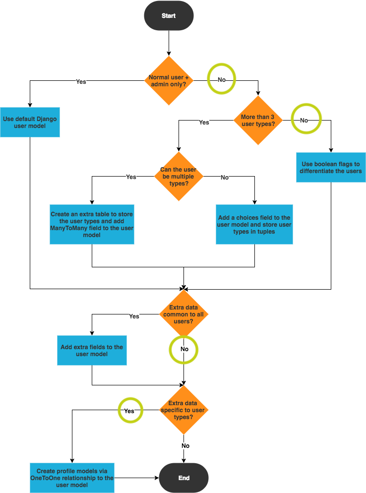

# Hue

This full-stack application was developed for Hue, an online art gallery and store where users can view and purchase artwork. The main goal of Hue's website is to display and sell their artwork to shoppers digitally. Hue is a fictional company that was created for the purpose of this project.

As the Milestone 4 Project for [Code Institute's](https://codeinstitute.net) [Full Stack Software Development Diploma Program](https://codeinstitute.net/full-stack-software-development-diploma/), Hue was built with HTML, CSS, Bootstrap 5, JavaScript, Python 3, and Django.

## UX

### Summary

Hue, a fictional art gallery & store, needs to move their business online and sell their work to customers digitally. The business needs software that gives them the ability to:

- Add, edit and remove products from the shop

- Receive payments upon purchases

- Sell and send products to customers

Hue's niche target market is comprised of male & female luxury art enthusiasts, ages 24 - 39, that want to preview and purchase art online. To meet the needs of these shoppers, Hue's website should allow them to:

- View art products

- Add selected products to a shopping cart

- Purchase items (via online Stripe payment)

- Sign up and become a member

- Login to persist shopping cart between visits

### Research & Planning

#### Users

During the research & planning phase of this milestone project, the developer completed the below flowchart activity, titled "Django Multiple User Types". This activity was conducted to determine how to properly build and implement the Django user model.

[djangomultipleusertypes](wireframes/djangomultipleusertypes.pdf)

As can be seen in the image above, the activity led the developer to make the following conclusions:

- Hue's user authentication model should define a one-to-one relationship, using the [``OneToOneField``](https://docs.djangoproject.com/en/3.1/topics/db/examples/one_to_one/).

- Hue should be built for **two** different types of users:

  1) The Site Owner
    - Hue, the company, that wants to:
        - Sell digital artwork.

    2) The Shopper
    - Digital art buyers that want to:
        - Purchase digital artwork from Hue online.   

#### User Stories

User stories were created by the [developer](https://www.github.com/alissatroiano) during the planning phase of this project. As practiced in agile development, each user story coincides with a feature of the Hue application and will be accomplished in one sprint.

#### The following user stories were created for the **shopper**:

### Database

#### Local Development

## Features

To meet all of Hue's goals and needs, this application will be built with the following features:

### Existing Features
- Home - A

- Gallery:

**Shopper**

- Allows *shoppers* to view, search, sort, and filter products, by having them visit the gallery and utilized the built-in tools.

**Site Owner**
- Gives *site owner* the opportunity to view the gallery page as a regular shopper/user would.

- Sign Up - Allows **all users** to create an account, by having them fill out a form that uses ``POST`` to send data.

- Login: 

**Shoppers**

- Provides an opportunity for **shoppers** to persist their cart between visits, by logging in.

**Site Owner**
- Allows the *site owner* to access special product management tools hidden from other users, by filling out a secure form that sends data and logging in.

- About: Allows **all users** to view information and images related to the business, by having them visit the about page.

### Features Left to Implement

## Technologies Used

- [Django](https://www.djangoproject.com/)
 - The project uses **Django** to simplify development and scalability.

- [django-allauth](https://django-allauth.readthedocs.io/en/latest/installation.html)
 - This project will uses **Allauth** to simplify user authentication, registration, account management and 3rd party (social media) login.

 - [sqlite3](https://docs.python.org/3/library/sqlite3.html)
 - This application is using ***sqlite3*** for internal data storage during local development.

 - [Pillow]() 
    - This project will use **the Python Imaging Library, Pillow** to add image processing capabilities to the Python interpreter.

- [Virtual Environment Wrapper](https://virtualenvwrapper.readthedocs.io/en/latest/index.html)
    - This project makes use of virtualenvwrapper extensions for creating and deleting virtual environments and managing local development.

- [Homebrew](https://brew.sh/)

    - This project uses Homebrew to simplify software and package installations in MacOS.

## Testing

## Deployment

## Credits

### Content

- The artwork categories in the database and application were copied from [Architecure Lab article "15 Types of Digital Art to Consider"](https://www.architecturelab.net/types-of-digital-art/)

- I copied Font Awesome's CDN from [cdnjs.com](https://cdnjs.com/libraries/font-awesome).

- The grayscale hover effect on the homepage was copied from this [Codepen](https://codepen.io/mhhasan320/pen/BwqvLL).

- I used this [Stack Overflow](https://stackoverflow.com/questions/31456576/django-footer-and-header-on-each-page-with-extends) thread for header, footer and body content templating with Django.

- The images used for this project were copied from:

    - [Pixabay](https://pixabay.com/illustrations/fractal-art-psychedelic-fantasy-2077883/)

## UX Design

- I copied components from [Bootstrap's documentation](https://getbootstrap.com/docs/5.0/components/navs-tabs/) to make Hue's navigation intuitive and responsive.

- The 'multiple light sources' text-shadow effect used for all social media font-awesome icons (`fab`) was copied from [CSS Tricks](https://designshack.net/articles/css/12-fun-css-text-shadows-you-can-copy-and-paste/).

- The layout and structure for the login (`login.html`) and signup (`signup.html`) pages were copied from this Bootstrap 5 Portal theme's login page (https://themes.3rdwavemedia.com/bootstrap-templates/startup/portal-free-bootstrap-admin-dashboard-template-for-developers/).

 by copying the contents of this Bootstrap 5 Portal theme's login page (https://themes.3rdwavemedia.com/bootstrap-templates/startup/portal-free-bootstrap-admin-dashboard-template-for-developers/)

### Media
- I used this article from [CSS Tricks](https://css-tricks.com/perfect-full-page-background-image/) to style the background image on Hue's homepage.

- Hue's images were copied from the following sources:

    - **Hero** background image: Pexels](https://www.pexels.com/photo/abstract-painting-2156881/)

    - The favicon image was downloaded from [The Noun Project](https://thenounproject.com/term/tint/120414/) and is licensed by [Creative Commons]()

- I learned how to configure a sitewide favicon in a Django project by following:

    - [W3](https://www.w3.org/2005/10/howto-favicon)

    - [Automation Panda](https://automationpanda.com/2017/12/17/django-favicon-setup-including-admin/)

    - [Tango with Django](https://www.tangowithdjango.com/book17/chapters/templates_static.html)

    - [Stack Overflow](https://stackoverflow.com/questions/5517950/django-media-url-and-media-root)

- The code used to create a custom cursor was copied from [W3 Schools](https://www.w3schools.com/cssref/pr_class_cursor.asp)

### Backend Functionality

- Django timezones were learned by reading [Django's documentation](https://docs.djangoproject.com/en/3.2/topics/i18n/timezones/).

- I copied syntax and referenced these articles to build the **shop**, **order** and **order items** models.

    - [Codegrepper](https://www.codegrepper.com/code-examples/python/product+manager+django)

    - [Medium](https://christosstath10.medium.com/create-your-own-point-of-sale-c25f8b1ff93b)

- The line of code for creating subcategories in Django (specifically the declaration of `parent` in `models.py`) was copied from ['Sub categories - How to build an Ecommerce website using Django 3 and Vue.js - Part 23'](https://www.youtube.com/watch?v=QIoUJ1PutV0)

## Utilities & tools
- [Diffchecker](https://www.diffchecker.com/#).

- [Random Key Gen](https://randomkeygen.com/).

- I learned how to set up Django project's in a virtual environemnt by reading these articles:

    - ['Setting up a Django development environment'](https://developer.mozilla.org/en-US/docs/Learn/Server-side/Django/development_environment) from [MDN Web Docs](https://developer.mozilla.org/en-US/)

    - ['Installation'](https://virtualenv.pypa.io/en/latest/installation.html#via-pip), [Virtualenv](https://virtualenv.pypa.io/en/latest/) docs.

    - [Virtualenvwrapper](https://virtualenvwrapper.readthedocs.io/en/latest/install.html)

    - ["Install Python3, Virtualenv, Django and Start a new project on your MacOS"](https://shishirthedev.medium.com/install-python3-virtualenv-django-and-start-a-new-porject-on-you-macos-de429ad3fbc0) from [Medium](https://medium.com)

    - ['Setup python, pip, virtualenv and virtualwrapper, with zsh on a new machine'](https://gist.github.com/dixneuf19/a398c08f00aac24609c3cc44c29af1f0)

    - [Python Tips](https://book.pythontips.com/en/testing/virtual_environment.html)

- Other resources I used during  **local development**

    - ['How to install pip in MacOS'](https://www.geeksforgeeks.org/how-to-install-pip-in-macos/#:~:text=pip%20can%20be%20downloaded%20and,directory%20as%20python%20is%20installed.&text=and%20wait%20through%20the%20installation,now%20installed%20on%20your%20system), [Geeksforgeeks](https://www.geeksforgeeks.org/)

    - [Homebrew](https://brew.sh/)

    - [Stack Exchange](https://superuser.com/questions/717105/how-to-show-full-path-of-a-file-including-the-full-filename-in-mac-osx-terminal/1493463)

    - [Sublime Text](https://packagecontrol.io/docs)

### Acknowledgements

### Research & Planning

- I learned about writing user stories for multiple end-users by reading the following articles:

 - "User Stories with Examples and Template" from [Atlassian article "User Stories with Examples and Template"](https://www.atlassian.com/agile/project-management/user-stories)

 - "User Stories and User Stories Examples", [Knowledge Hut article "User Stories and User Stories Examples](https://www.knowledgehut.com/blog/agile/user-stories-examples)

- I learned how to make user stories that capture feature requirements from:

 - [Code Insitute](https://codeinstitute.net/)

 - [Knowledge Hut article "User Stories and User Stories Examples"](https://www.knowledgehut.com/blog/agile/user-stories-examples)

- I learned about different target markets by reading:

    - [Marketing Artfully article "Customer Demographics - Age Demographics for Advertising"][https://marketingartfully.com/customer-demographics-age-demographics-for-advertising/]

- I referenced (Django's Documentation)[https://docs.djangoproject.com/en/3.2/] for the following topics:

    - [Timezones](https://docs.djangoproject.com/en/3.2/)

    - [Models](https://docs.djangoproject.com/en/3.2/topics/db/models/)

    - [Writing Custom Model Fields](https://docs.djangoproject.com/en/3.2/howto/custom-model-fields/)

    - [Creating Forms from Models](https://docs.djangoproject.com/en/3.2/topics/forms/modelforms/)