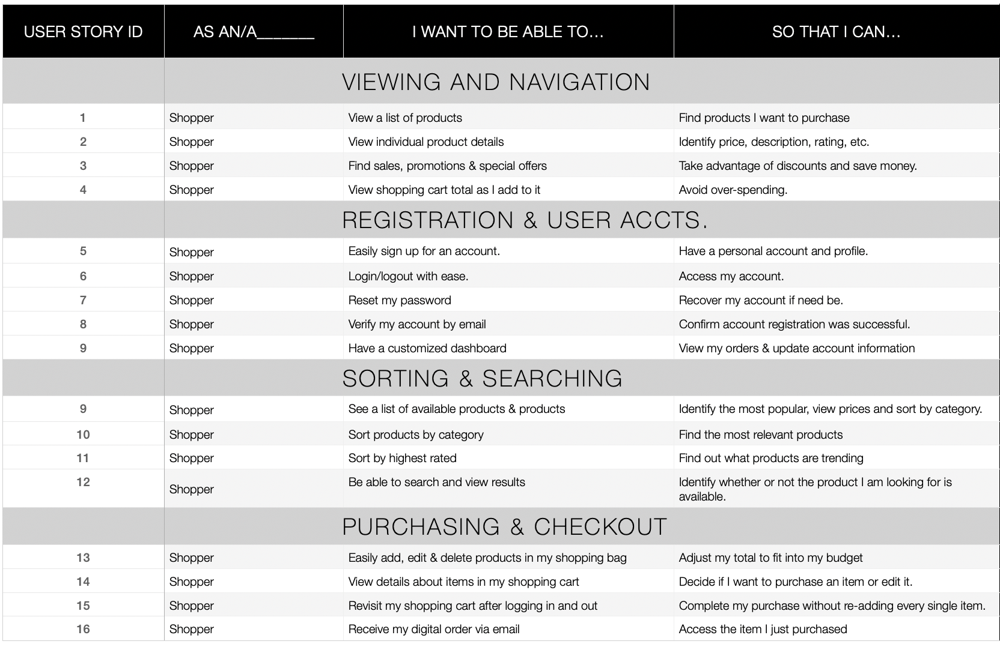
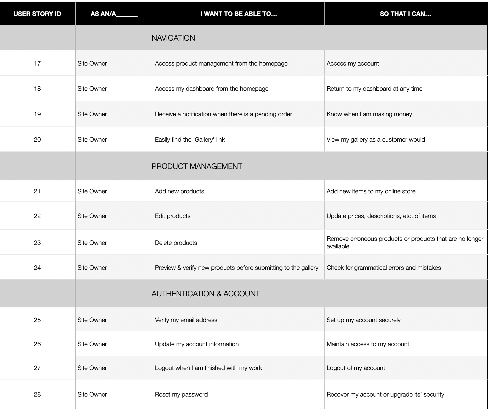

# Hue

This full-stack application was developed for Hue, an online art gallery and store where users can use AI to create, share, and sell awesome digital artwork and photography. Hue’s AI art  and image models are powered by the MindsDB Dall-E integration, which has been trained on 400 million labeled datasets. 

Hue's AI models were all specially trained to generate artwork in the likeness of specific artists and genres. 
 
Hue was built with HTML, CSS, Bootstrap 5, JavaScript, Python 3, and Django. Hue's checkout functionality is powered by the Stripe API. All AI image generation functionality.

## Features

To meet all of Hue's goals and needs, this application will be built with the following features:

### Existing Features

- Home - A landing page that allows **all users** to view information and images related to the application, by having them visit the home page.

    - About: Allows **all users** to view information and images related to the business, by having them visit the about page.

    - Features: Allows **all users** to view information and images related to the main features of this applicaton, by having them visit the features section.

- Sign Up - Allows **new users** to create an account, by having them fill out a form that uses ``POST`` to send data.

- Login: Allows **exisiting users** to login to their account, by having them fill out a form that uses ``POST`` to send data.

- Explore: Allows **all users** to view AI generated artwork & imagery in the database, by having them visit the explore page.

- Add Artwork: Allows **registered users** to use Hue's specially trained mmodels to create custom artwork, by having them fill out the 'Add Artwork' form.

- Profile: Allows **registered users** to edit their account details, view order history, and manage their AI creations, by having them visit the profile page.

- Edit Artwork: Allows **registered users** to edit their AI creations, by having them fill out the 'Edit Artwork' form.

- Delete Artwork: Allows **registered users** to delete their AI creations, by having them click the 'Delete Artwork' button.

- Sell Artwork: Allows **registered users** to sell their AI creations, by having them fill out the 'Sell Artwork' form.

- FAQ: Allows **all users** to view frequently asked questions pertaining to Dall-E's content policy and commercialization policy, by having them visit the FAQ page.
### Features Left to Implement

- ChatGPT-4 Integration: this feature will replace the exisiting random prompt generator, currently powered by JavaScript, with a more robust and intelligent prompt generator powered by **MindsDB's** integration with **OpenAI's** **ChatGPT-4** model.

    - The logic for ths feature will be implemented in the back-end, using Python, Django and the **MindsDB Python SDK**.

- AI Artwork Marketplace: Will allow **registered users** to sell their AI creations to other users

    - The existing Stripe logic will be extended for peer-to-peer transactions.
## Technologies Used

- [Django](https://www.djangoproject.com/)
 - The project uses **Django** to simplify development and scalability.

- [django-allauth](https://django-allauth.readthedocs.io/en/latest/installation.html)
 - This project will uses **Allauth** to simplify user authentication, registration, account management and 3rd party (social media) login.

 - [sqlite3](https://docs.python.org/3/library/sqlite3.html)
 - This application is using ***sqlite3*** for internal data storage during local development.

 - [Pillow](https://pillow.readthedocs.io/en/stable/) 
    - This project will use **the Python Imaging Library, Pillow** to add image processing capabilities to the Python interpreter.

- [Virtual Environment Wrapper](https://virtualenvwrapper.readthedocs.io/en/latest/index.html)
    - This project makes use of virtualenvwrapper extensions for creating and deleting virtual environments and managing local development.

- [Homebrew](https://brew.sh/)
     - This project uses Homebrew to simplify software and package installations in MacOS.

- [Bootstrap 5](https://getbootstrap.com/docs/5.0/getting-started/introduction/)
    - This project uses **Bootstrap 5** to simplify the structure of the website and make the website responsive easily.

- [Crispy Forms](https://django-crispy-forms.readthedocs.io/en/latest/)

- [Crispy-Bootstrap5](https://pypi.org/project/crispy-bootstrap5/) 
- This project uses crispy filters & tags to control the rendering behavior of Django forms in a consistent, visually appealing and *DRY* manner.

- [MindsDB](https://mindsdb.com/)
    - This project uses MindsDB's Dall-E integration to power Hue's AI art and image models.

- [MindsDB Python SDK](https://docs.mindsdb.com/quick-start/python-sdk/)
    - This project uses MindsDB's Python SDK to power Hue's AI art and image models.

- [OpenAI](https://openai.com/)
    - This project uses OpenAI's Dall-E model to power Hue's AI art and image models.

- [Dall-E](https://openai.com/blog/dall-e/)
    - This project uses OpenAI's Dall-E model to power Hue's AI art and image models.

- [Stripe](https://stripe.com/docs/api)
    - This project uses Stripe's API to power Hue's checkout functionality.

- [Heroku](https://www.heroku.com/)
    - This project uses Heroku to deploy the application.

- [AWS S3](https://aws.amazon.com/s3/)
    - This project uses AWS S3 to store static and media files.

- [Git](https://git-scm.com/)
    - This project uses **Git** for version control, by utilizing the Gitpod terminal to commit to Git and Push to GitHub.

- [GitHub](https://github.com)
    - This project uses **GitHub** to store and share all project code remotely.

- [Balsamiq](https://balsamiq.com/)
    - This project uses **Balsamiq** to create the wireframes during the design process.

- [Google Fonts](https://fonts.google.com/)
    - This project uses **Google fonts** to style the website fonts.

- [Font Awesome](https://fontawesome.com/)
    - This project uses **Font Awesome** for the social media icons.

- [W3C Markup Validation Service](https://validator.w3.org/)
    - This project uses **W3C Markup Validation Service** to validate HTML code.

- [W3C CSS Validation Service](https://jigsaw.w3.org/css-validator/)
    - This project uses **W3C CSS Validation Service** to validate CSS code.

- [JSHint](https://jshint.com/)
    - This project uses **JSHint** to validate JavaScript code.

- [PEP8](http://pep8online.com/)
    - This project uses **PEP8** to validate Python code.

- [Am I Responsive?](http://ami.responsivedesign.is/)
    - This project uses **Am I Responsive?** to test the responsiveness of the website across multiple devices.

- [Autoprefixer CSS online](https://autoprefixer.github.io/)
    - This project uses **Autoprefixer CSS online** to add vendor prefixes to CSS code.

## Testing

### Research & Planning

#### User Stories

User stories were created by the [developer](https://www.github.com/alissatroiano) during the planning phase of this project. As practiced in agile development, each user story coincides with a feature of the Hue application and will be accomplished in one sprint.

#### The following user stories were created for the **shopper**:

## Credits

### Content

- The artwork categories in the database and application were copied from [Architecure Lab article "15 Types of Digital Art to Consider"](https://www.architecturelab.net/types-of-digital-art/)

- I copied Font Awesome's CDN from [cdnjs.com](https://cdnjs.com/libraries/font-awesome).

- The grayscale hover effect on the homepage was copied from this [Codepen](https://codepen.io/mhhasan320/pen/BwqvLL).

- I used this [Stack Overflow](https://stackoverflow.com/questions/31456576/django-footer-and-header-on-each-page-with-extends) thread for header, footer and body content templating with Django.

- The images used for this project were copied from:

- [Pixabay](https://pixabay.com/illustrations/fractal-art-psychedelic-fantasy-2077883/)

- [OpenAI](https://openai.com/blog/dall-e/)

- [Dall-E](https://openai.com/blog/dall-e/)

## UX Design

- I copied components from [Bootstrap's documentation](https://getbootstrap.com/docs/5.0/components/navs-tabs/) to make Hue's navigation intuitive and responsive.

- The 'multiple light sources' text-shadow effect used for all social media font-awesome icons (`fab`) was copied from [CSS Tricks](https://designshack.net/articles/css/12-fun-css-text-shadows-you-can-copy-and-paste/).

- The layout and structure for the login (`login.html`) and signup (`signup.html`) pages were copied from this Bootstrap 5 Portal theme's login page (https://themes.3rdwavemedia.com/bootstrap-templates/startup/portal-free-bootstrap-admin-dashboard-template-for-developers/).

 by copying the contents of this Bootstrap 5 Portal theme's login page (https://themes.3rdwavemedia.com/bootstrap-templates/startup/portal-free-bootstrap-admin-dashboard-template-for-developers/)

### Front End Snippets & Resources
- I used this article from [CSS Tricks](https://css-tricks.com/perfect-full-page-background-image/) to style the background image on Hue's homepage.

- Hue's images were copied from the following sources:

    - **Hero** background image: Pexels](https://www.pexels.com/photo/abstract-painting-2156881/)

    - The favicon image was downloaded from [The Noun Project](https://thenounproject.com/term/tint/120414/) and is licensed by [Creative Commons]()

- I learned how to configure a favicon in a Django project by following:

    - [W3](https://www.w3.org/2005/10/howto-favicon)

    - [Automation Panda](https://automationpanda.com/2017/12/17/django-favicon-setup-including-admin/)

    - [Tango with Django](https://www.tangowithdjango.com/book17/chapters/templates_static.html)

    - [Stack Overflow](https://stackoverflow.com/questions/5517950/django-media-url-and-media-root)

- The code used to create a custom cursor was copied from [W3 Schools](https://www.w3schools.com/cssref/pr_class_cursor.asp)

- I found the solution to disable right-clicking, dragging and selecting images so I could protect products that are delivered via digital-download and avoid giving them away for free from [Medium](https://medium.com/@marzouk/how-to-prevent-saving-image-as-or-dragging-image-to-download-it-in-a-web-page-f0ee4121b32f) 

### Backend Snippets & Resources

- Django timezones were learned by reading [Django's documentation](https://docs.djangoproject.com/en/3.2/topics/i18n/timezones/).

- I copied syntax and referenced these articles to build the **shop**, **order** and **order items** models.

    - [Codegrepper](https://www.codegrepper.com/code-examples/python/product+manager+django)

    - [Medium](https://christosstath10.medium.com/create-your-own-point-of-sale-c25f8b1ff93b)

- The line of code for creating subcategories in Django (specifically the declaration of `parent` in `models.py`) was copied from ['Sub categories - How to build an Ecommerce website using Django 3 and Vue.js - Part 23'](https://www.youtube.com/watch?v=QIoUJ1PutV0).

- I followed this video while setting up custom confirmation emails with Django & Google SMTP [Automating confirmation emails with Django](https://www.youtube.com/watch?v=1BaLWYUO1k4).

## Utilities & tools
- [Diffchecker](https://www.diffchecker.com/#).

- [Random Key Gen](https://randomkeygen.com/).

- I learned how to set up Django project's in a virtual environemnt by reading these articles:

    - ['Setting up a Django development environment'](https://developer.mozilla.org/en-US/docs/Learn/Server-side/Django/development_environment) from [MDN Web Docs](https://developer.mozilla.org/en-US/)

    - ['Installation'](https://virtualenv.pypa.io/en/latest/installation.html#via-pip), [Virtualenv](https://virtualenv.pypa.io/en/latest/) docs.

    - [Virtualenvwrapper](https://virtualenvwrapper.readthedocs.io/en/latest/install.html)

    - ["Install Python3, Virtualenv, Django and Start a new project on your MacOS"](https://shishirthedev.medium.com/install-python3-virtualenv-django-and-start-a-new-porject-on-you-macos-de429ad3fbc0) from [Medium](https://medium.com)

    - ['Setup python, pip, virtualenv and virtualwrapper, with zsh on a new machine'](https://gist.github.com/dixneuf19/a398c08f00aac24609c3cc44c29af1f0)

    - [Python Tips](https://book.pythontips.com/en/testing/virtual_environment.html)

- Other resources I used during  **local development**

    - ['How to install pip in MacOS'](https://www.geeksforgeeks.org/how-to-install-pip-in-macos/#:~:text=pip%20can%20be%20downloaded%20and,directory%20as%20python%20is%20installed.&text=and%20wait%20through%20the%20installation,now%20installed%20on%20your%20system), [Geeksforgeeks](https://www.geeksforgeeks.org/)

    - [Homebrew](https://brew.sh/)

    - [Stack Exchange](https://superuser.com/questions/717105/how-to-show-full-path-of-a-file-including-the-full-filename-in-mac-osx-terminal/1493463)

    - [Sublime Text](https://packagecontrol.io/docs)

    - [MindsDB](https://docs.mindsdb.com/quick-start/python-sdk/) for installing the MindsDB Python SDK.

    - [Django](https://docs.djangoproject.com/en/3.2/topics/install/) for installing Django.

    - [Django Allauth](https://django-allauth.readthedocs.io/en/latest/installation.html) for installing Django Allauth.

    - [Stripe](https://stripe.com/docs/development/quickstart) for installing Stripe.

    - [ChatGPT](https://chat.openai.com/) for code snippets and installation instructions.

### Security

- I copied the following settings(located in `settings.py`) from [Django's Documentation]()

    - [SECURE_SSL_REDIRECT](https://docs.djangoproject.com/en/3.2/ref/settings/#std:setting-SECURE_SSL_REDIRECT)

## Acknowledgements

- I followed [Code Insitute's](https://learn.codeinstitute.net/) video lessons for the first version of this software.

- I learned about writing user stories for multiple end-users by reading the following articles:

 - "User Stories with Examples and Template" from [Atlassian article "User Stories with Examples and Template"](https://www.atlassian.com/agile/project-management/user-stories)

 - "User Stories and User Stories Examples", [Knowledge Hut article "User Stories and User Stories Examples](https://www.knowledgehut.com/blog/agile/user-stories-examples)

 - I referenced [this article](https://opensource.com/article/18/6/git-reset-revert-rebase-commands) for any commands related to `git reset`, `git revert` or `git rebase`

- I learned how to make user stories that capture feature requirements from:

 - [Code Insitute](https://codeinstitute.net/)

 - [Knowledge Hut article "User Stories and User Stories Examples"](https://www.knowledgehut.com/blog/agile/user-stories-examples)

- I learned about different target markets by reading:

    - [Marketing Artfully article "Customer Demographics - Age Demographics for Advertising"][https://marketingartfully.com/customer-demographics-age-demographics-for-advertising/]

- I referenced (Django's Documentation)[https://docs.djangoproject.com/en/3.2/] for the following topics:

    - [Timezones](https://docs.djangoproject.com/en/3.2/)

    - [Models](https://docs.djangoproject.com/en/3.2/topics/db/models/)

    - [Writing Custom Model Fields](https://docs.djangoproject.com/en/3.2/howto/custom-model-fields/)

    - [Creating Forms from Models](https://docs.djangoproject.com/en/3.2/topics/forms/modelforms/)

I referenced this article from MindsDB's documentation when building my own specialized Dall-E models:
    - [Tutorial: how to add AI image generation to your own app](https://mindsdb.com/blog/tutorial-how-to-add-ai-image-generation-to-your-own-app)
