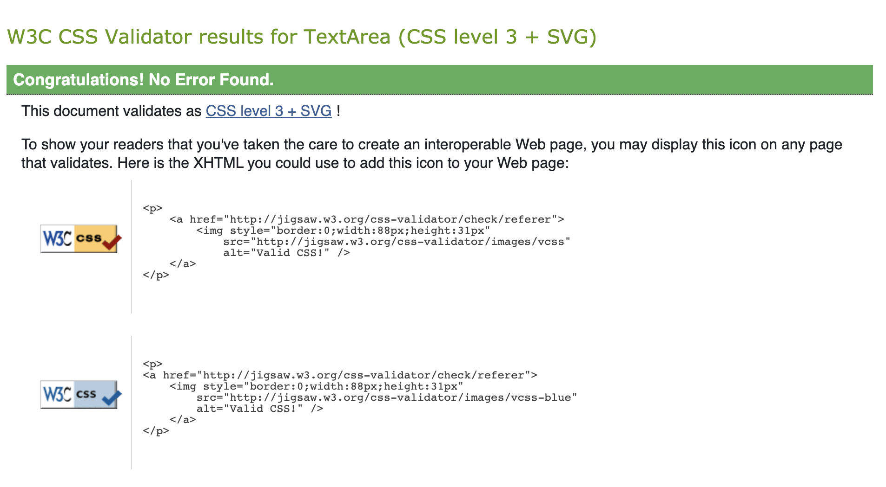
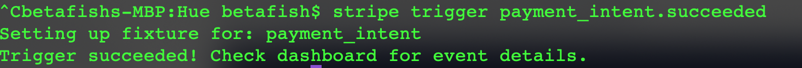

# TESTING.md

## Front-End Tests

### HTML

#### W3 Validator HTML Validator Template Tests
- 1. Visit [W3 Validator](https://validator.w3.org/nu/#textarea).
- 2. Open workspace and copy the contents of `base.html`.
- 3. Navigate back to HTML Validator and paste clipboard contents into text area.
- 4. Submit the form.
- 5. Carefully review all warnings and errors.
- 6. Disregard errors caused by Django template blocks, etc.
- 7. Fix all errors related to HTML until there are no more that can be fixed.
- 8. Repeat steps 1-4 to ensure all possible errors have been removed from the base template.
- 9. Follow steps 1-7 for the following custom Django templates:
    - [x] [mobilenavbar.html](templates/includes/mobilenavbar.html)
    - [x] [shopnav.html](templates/includes/shopnav.html)

### CSS

#### W3C Jigsaw Test
**CSS Validation Testing**
- Date: July 8, 2021
- Issue: 'CSS Validation Service Testing'
- 1. Visit [W3C Jigsaw CSS Validation Service](https://jigsaw.w3.org/css-validator/).
- 2. Open workspace and copy the contents of [base.css](static/css/base.css).
- 3. Navigate back to CSS Validator and paste clipboard contents into text area.
- 4. Submit the form.
- 5. Carefully review all warnings and errors.
- 6. Fix all errors until there are no more and the page reads:

- 7. Repeat test if/when any changes are made to stylesheet.

## Back-End Tests

### **Database Tests**
**Database Conflict Test #1**
- Date: June 28, 2021, 4:38pm
- Issue: 'Build failed after replacing Django model fields'
	- 1. Open `hue-alissa.herokuapp.com` in web browser
	- 2. Navigate to 'hue-alissa.herokuapp.com/admin' and click on 'Orders'
	- 3. Observe an error message in the admin caused by missing fields.
	- 4. Retrace steps in development process.
	- 5. Determine problem was most likely caused by manually deleting migration files and only performing `zero-out` migration on the SQLite (development) database.
	- 6. Conclude that this activity led to the corruption.
	- 7. Determine best course of action and take the following steps:
			- Provision a new PostgreSQL database on Heroku.
			- Connect the database to manage.py
			- Load data into new database.

**Order Model Timestamp Test #1**
- Issue: 'Receipts for orders incorrectly timestamped'
	- 1. Open `hue-alissa.herokuapp.com` in web browser
	- 2. Navigate to 'hue-alissa.herokuapp.com/admin' and click on 'Shop'
	- 3. Add products to cart and proceed to checkout for test.
	- 4. Fill out form and select, 'Complete Order'.
	- 5. Observe order confirmation is displayed upon submitting order form.
	- 6. Review `checkout_success.html` and notice outputted 'time' is 4 hours ahead.
	- 7. Ensure date is accurate and check order summary for additional errors.
	- 8. Open my IDE and visit `checkout/models.py` to ensure `date` field is set up properly.
	- 9. Use Google, Stack Overflow & Django's documentation to learn about datetime and timezone settings.
	- 10. Update the datetime import on the top of `checkout/models.py` to read:
			- `import datetime`
			- `now = datetime.datetime.now()`
	- 11. Complete steps 1 - 7 again and observe that time is still incorrect (displaying one hour early now).
	- 12. Review Django''s documentation again.
	- 13. Decide to set timezone across project by updating `settings.py` with timezone setting:
			- `USE_TZ` = True 
			- `TIME_ZONE = 'America/New_York'`

### Heroku
**Build Failed Test #2**
- Date: June 30, 2021
	- 1. Open `hue-alissa.herokuapp.com` in web browser
	- 2. Observe Heroku 'Application Error' is rendering on the front-end of the app..
	- 3. Open a terminal and enter `heroku logs -tail`.
	- 4. Read through error log.
	- 5. Read error, `storages module could not be found`.
	- 6. Visit, `settings.py` file and ensure storages are properly configured.
	- 7. Visit Git repository on GitHub.
	- 8. Inspect the commit that corresponds with the last successful build on Heroku. 
	- 9. Review entire commit history from that day, paying close attention to any environmental changes that may have led to the crash.
	- 10. Visit `Google` and enter search the topic.
	- 11. Observe a post on Stack Overflow, advising to ensure django-storages was/is not installed outside of a django virtual environment.
	- 12. Visit the command line and enter `pip freeze` from my default bash profile.
	- 13. Review the contents of requirements.txt
	- 14. Activate my virtual environment and enter `pip freeze`.
	- 15. Review the contents of requirements.txt and notice `django-storages` is not listed in the file.
	- 16. Reinstall django-storages from my virtual environment.
	- 17. Freeze the requirements file.
	- 18. Save, commit and push these changes to Heroku.

### Stripe Tests
**Test #1: Setup Stripe CLI**
- Date: July 10, 2021, 10:38am
- Objective: 'Setup Stripe CLI'
  - 1. Open terminal in local development environment.
  - 2. Use Homebrew to install the Stripe CLI: `brew install stripe/stripe-cli/stripe`
  - 3. Login: `stripe login`
  - 4. Ensure the output includes a Stripe pairing code, then press Enter to open browser and login to Stripe.
  - 5. Run a test command to ensure setup was successful: `stripe customers create`.
  - 6. Review raw Customer Object JSON output..
  - 7. Navigate to Stripe Dashboard and confirm that a new customer object has been created successfully.
  
**Test #2: Use Stripe CLI to Test Webhook Endpoint**
- Date: July 10, 2021, 10:45am
- Objective: 'Test Stripe webhook endpoint using Stripe CLI'
  - 1. Open terminal in local development environment.
  - 2. Enter `stripe listen` to begin listening for events.
  - 3. Review output ` Ready! Your webhook signing secret is whsec_##############`.
  - 4. Trigger an event: `stripe trigger payment_intent.succeeded`
	
  - 5. Review output:
	
  - 6. Forward events to my local server: `stripe listen --forward-to localhost:8000/checkout/wh/`
  - 7. Observe output with new signing secret.
